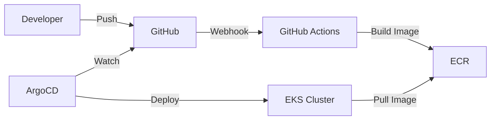

# ${{ values.name }}

${{ values.description }}

## Overview

This is a Python Flask application deployed to Amazon EKS using ArgoCD for GitOps-based continuous deployment.

## Quick Start

### Local Development

```bash
# Create virtual environment
python -m venv venv
source venv/bin/activate

# Install dependencies
pip install -r app/requirements.txt

# Run locally
cd app && python app.py
```

### Access the API

| Endpoint | Description |
|----------|-------------|
| `/` | Home page - shows app status |
| `/health` | Health check for Kubernetes liveness probe |
| `/ready` | Readiness check for Kubernetes readiness probe |
| `/s3/buckets` | List S3 buckets (requires AWS credentials) |

## Architecture



## Deployment

This application is automatically deployed via ArgoCD when changes are pushed to the `main` branch.

- **ArgoCD Application**: `${{ values.name }}`
- **Namespace**: `${{ values.namespace }}`
- **Helm Chart**: `charts/${{ values.name }}`

See [Deployment Guide](deployment.md) for more details.
